# Hospital-Management-System
A simple and user friendly Hospital Management System created using JSF-2.0 during Hackathon 2017, Infosys, Chandigarh
<br />
## Roles:
* Patient
* Doctor
* Admin
* API

## Prerequisites
```
1) Java EE IDE.
2) Apache Tomcat Server
    - Goto Apache/conf/context.xml
    - Edit it
    - Uncomment <Manager pathname="" /> tag in the XML to disable session persistence across Tomcat restarts
3) MySql Database
    - Import the MySql dump provided.
```
## Installing

* Integrate the MySql Database by changing the database password.
```
- Edit AccountModel.java and DocAccountModel.java in workspace/Project Name/src/model
- Edit the getConnection() private function
- Change the variable pass with the password of the database
- Change the username of the database as the 2nd argument in the call to DriverManager.getConnection() function. The default username is “root”.
```
* 'import' the project into your workspace and right click on project name and run it on the server.
## Built With
* [JSF-2](https://en.wikipedia.org/wiki/JavaServer_Faces)
* [Primefaces](https://www.primefaces.org/)
* [Omnifaces](showcase.omnifaces.org/)

## Screenshots
* Homepage
    
    * Login Page
    
    
    
    * Patient Register Page
    
    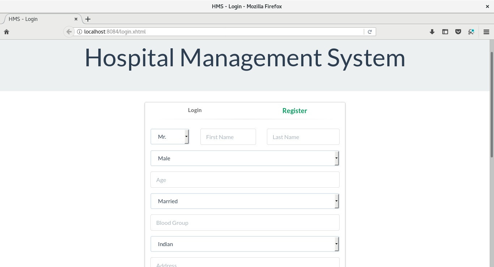
    
* Patient’s Pages
    
    * Book Appointment
    
    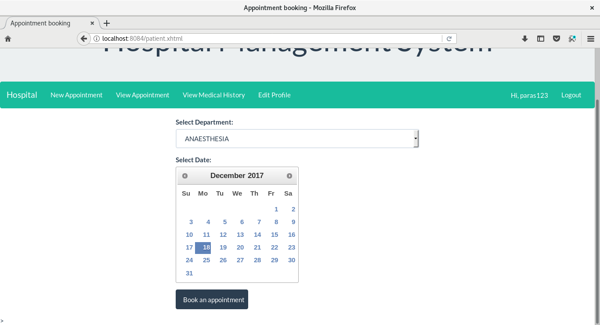
    
    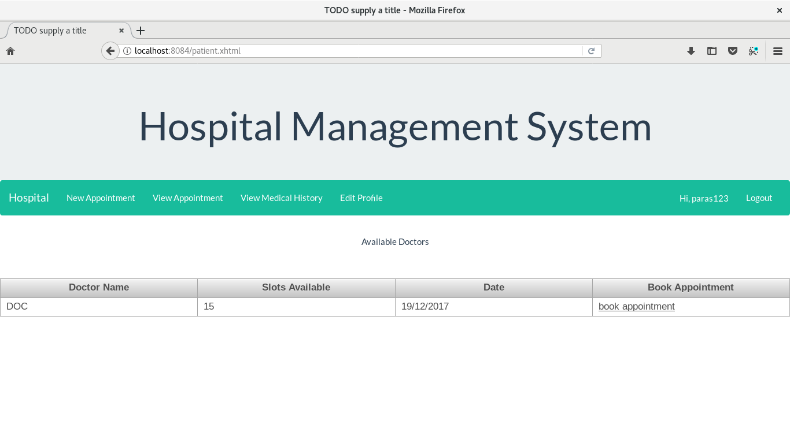
    
    * View Appointment
    
    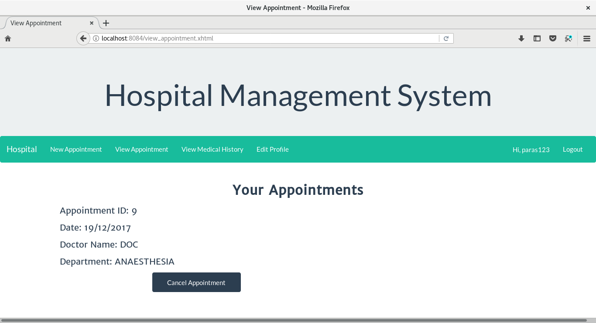
    
    * View Medical History
    
    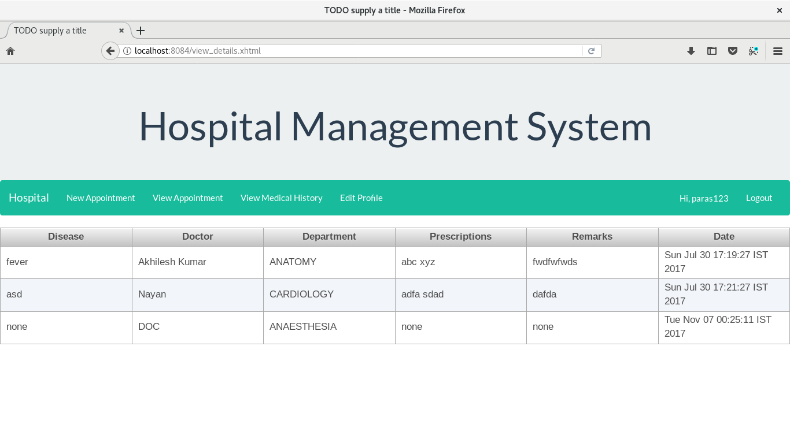
    
    * Edit Profile
    
    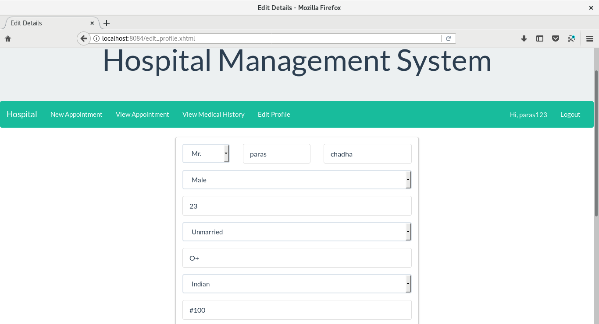
    
* Doctor’s Pages
    
    * View Appointments
    
    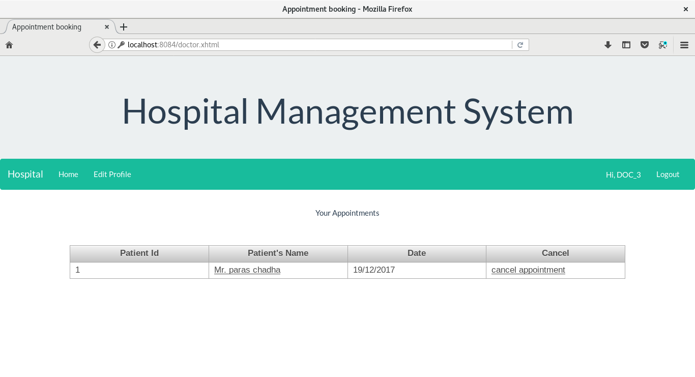
    
    * View patient details
    
    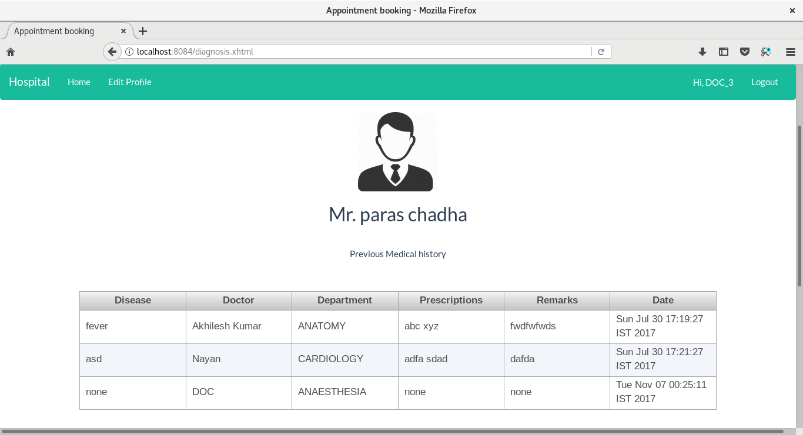
    
    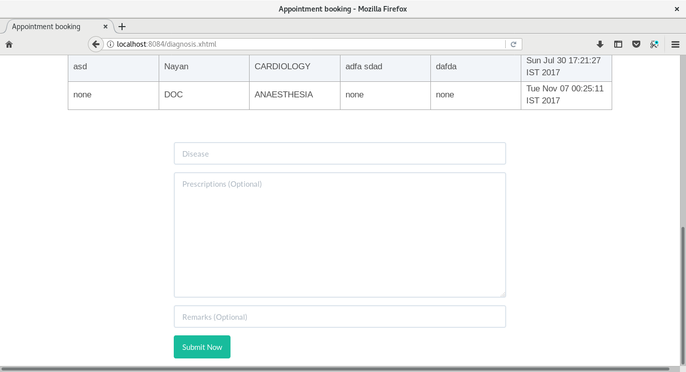
    
    * Edit Profile
    
    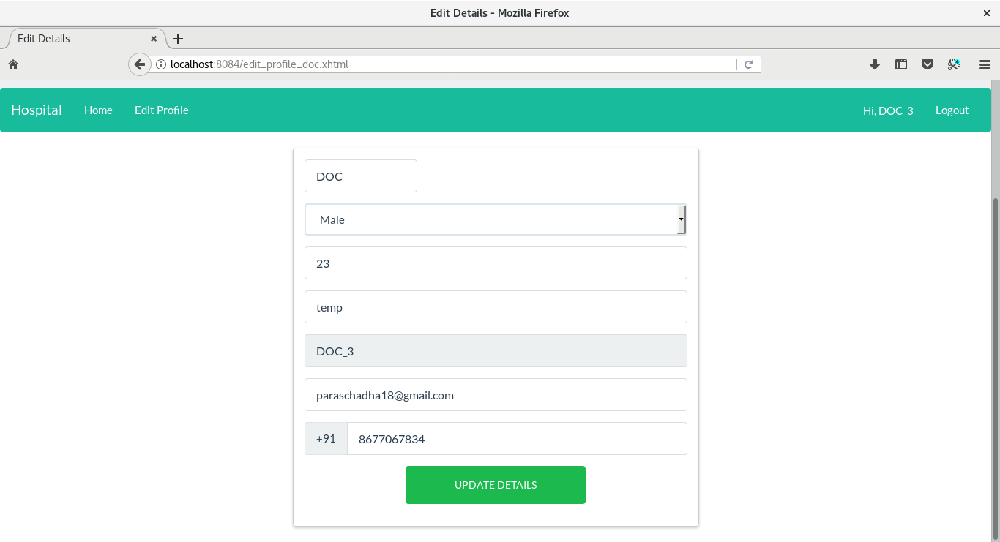
    
* Admin’s Pages
    
    * Add new doctor
    
    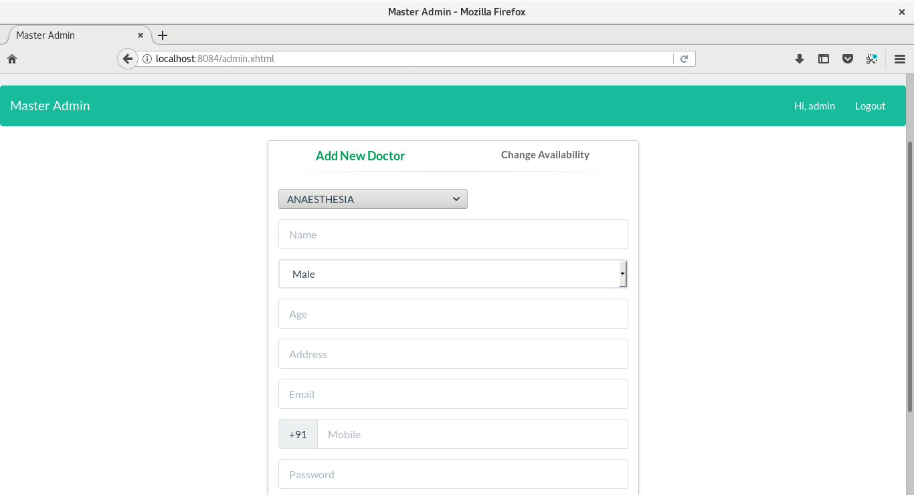
    
    * Change Availability of Doctor
    
    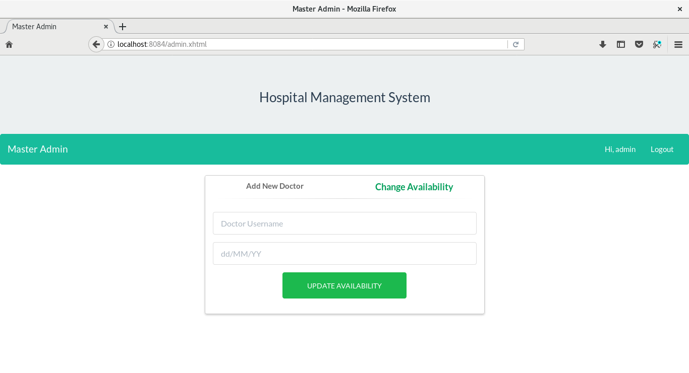
    
## What's Next
* Work Under Progress (Some modules are being worked upon..)

## Any Issues?
Found any Bug? Please feel free to report it. :)
